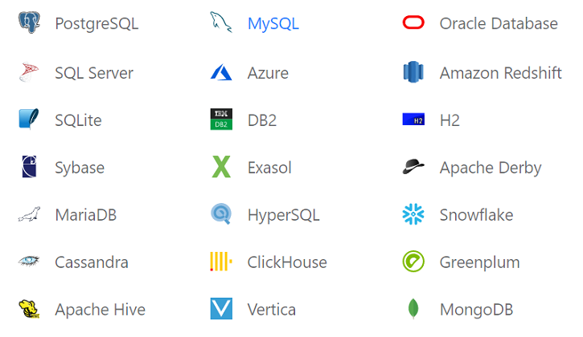
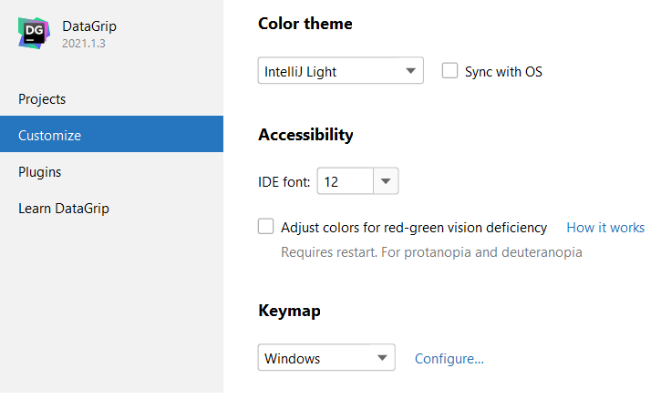
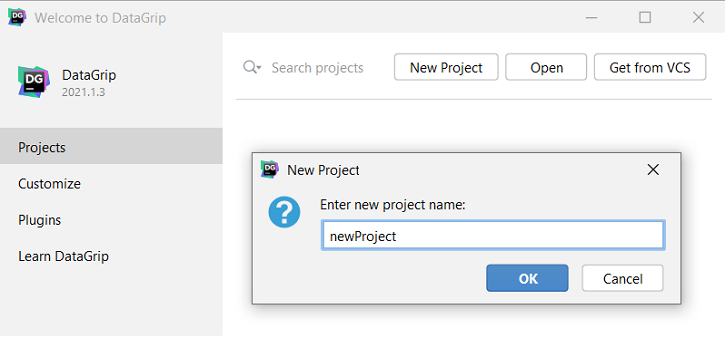
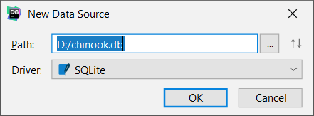
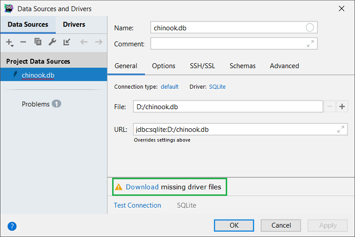
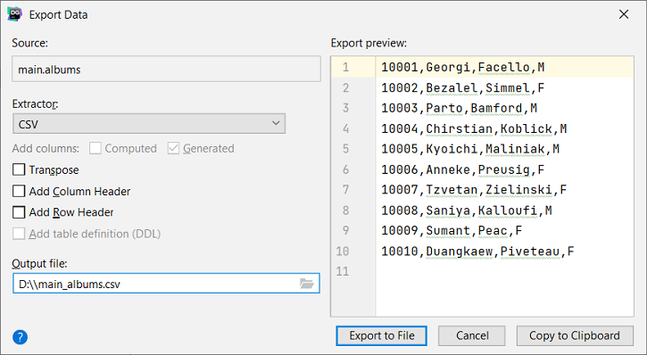
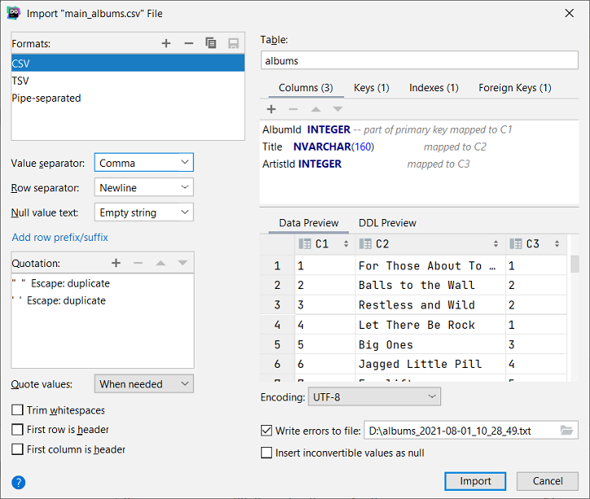

# DataGrip Quick Start Guide

## Contents

- [Introduction](#introduction)
- [Before you start](#before-you-start)
- [First launch](#first-launch)
- [Customize the appearance](#customize-the-appearance)
- [Create a project](#create-a-project)
- [Add data sources](#add-data-sources)
- [Run a query](#run-a-query)
- [Export and import data](#export-and-import-data)
  - [Export data to file](#export-data-to-file)
  - [Import data from file](#import-data-from-file)
- [Useful links](#useful-links)
  - [Video tutorial](#video-tutorial)
  - [Related topics](#related-topics)

## Introduction<a id="introduction"></a>

DataGrip is a comprehensive database management solution. It is designed to query and manage local, server, and cloud databases. It supports the most popular database management systems.



This guide aims to give you the first experience of the product. By following this guide, you will learn the basic DataGrip features, create your first project, and try out managing a local database.

## Before you start<a id="before-you-start"></a>

- [Download](https://www.jetbrains.com/datagrip/download) and [install](https://www.jetbrains.com/help/datagrip/2021.2/installation-guide.html) DataGrip.
- Optionally: [Download](https://drive.google.com/file/d/1iJHTQ-TDXjvFUBS3yGvOlZVpBgArAygA/view?usp=sharing) a sample SQLite database (chinook.db).<a id="sample"></a>

## First launch<a id="first-launch"></a>

When you launch DataGrip for the first time, the initial configuration wizard opens. It has the following menus:

- **Projects**. [Create your first project](#create-a-project).
- **Customize**. [Fine-tune the application appearance](#customize-the-appearance) to suit your personal preferences and special needs.
- **Plugins**. Get access to the marketplace and manage plugins to get the most of DataGrip.
- **Learn DataGrip**. Find links to DataGrip documentation, demos and screencasts, and other useful information.

## Customize the appearance<a id="customize-the-appearance"></a>

To customize the application appearance from the initial configuration wizard:

1. On the left panel, click **Customize**.
2. Choose the following preferences:
    - Color theme
    - Accessibility options
    - Keymap scheme<br>


To learn more, see [IDE appearance](https://www.jetbrains.com/help/datagrip/2021.2/guided-tour-around-the-user-interface.html).

## Create a project<a id="create-a-project"></a>

A DataGrip project is a complex of your data sources, console and scratch files, and attached folders.

To create a project from the initial configuration wizard:

1. On the left panel, click **Project**.
2. Click **New project** and enter a name.
3. Click **OK**.<br>


## Add data sources<a id="add-data-sources"></a>

A project can contain a number of data sources. To add a data source:

1. On the **Database** pane, click  and select **Data source from Path**.
2. Browse for a database file, and double-click it, or select and click **OK**. You can add the sample [chinook.db](#sample) database or another available local database.
3. Select a driver, and click **OK**.<br>

4. In the **Data Sources and Drivers** dialog that opens, click **OK**.

JDBC drivers are not bundled with the installation package to reduce its size. To install the driver files:

1. On the **Database** pane, click .
2. At the bottom of the **General** tab, click **Download missing driver files**.
3. Wait till the installation is over.<br>


To learn more, see [Database connection](https://www.jetbrains.com/help/datagrip/2021.2/connecting-to-a-database.html).

## Run a query<a id="run-a-query"></a>

Query consoles are SQL files in which you can compose and execute SQL statements. DataGrip creates a query console automatically when you create a data source. See [Query consoles](https://www.jetbrains.com/help/datagrip/working-with-database-consoles.html) for more details.

To create a query console:

1. Right-click a data source
2. Select **New | Query Console**.
3. Type in a query statement. For example, for the sample database, type the following query:
    ```sql
    select * from albums
    where ArtistId = '16'
    ```
4. To run the query, do either of the following:
    - Click  on the toolbar.
    - Press **Ctrl+Enter**.
    - Right-click the code, and in the context menu, click **Execute**.
  
For the sample SQLite database, you'll see the following result:


Besides the console, you can run a query from scratch files and user files. To learn more, see [Run database code](https://www.jetbrains.com/help/datagrip/run-a-query.html).

## Export and import data<a id="export-and-import-data"></a>

DataGrip provides an engine to move data between databases in various formats. You can select a predefined format or create a custom one.

### Export data to file<a id="export-data-to-file"></a>

1. On the **Database** pane, right-click a schema or a table and select **Export Data to File(s)**.
2. In the **Export Data** dialog, provide the following required parameters:
    - **Extractor**. This defines the export file format, such as CSV, XLSX, or XML.
    - **Output file**. The path to the export file and its name.
3. Optionally, select **Transpose**. In the transposed view, the rows and columns in the export file will be interchanged.
4. Click **Export to File**.<br>


See [Export](https://www.jetbrains.com/help/datagrip/2021.2/export-data.html) to learn about other data export options (for example, using the data editor).

### Import data from file<a id="import-data-from-file"></a>

1. On the **Database** pane, right-click a schema or a table and select **Import Data from File**.
2. Browse for a file that contains delimiter-separated values and click **OK**.
3. In the **Import File** dialog, select the data conversion parameters.
4. Click **Import**.<br>


See [Import](https://www.jetbrains.com/help/datagrip/2021.2/import-data.html) to learn about other data import options (for example, using a script file).

## Useful links<a id="useful-links"></a>

### Video tutorial<a id="video-tutorial"></a>

This [40-minute video tutorial](https://www.youtube.com/watch?v=U5SOD-eeK50) illustrates the most fundamental DataGrip features. The video is split up into chapters, which you can jump to by clicking timecodes in the video description.

 <a href="https://www.youtube.com/watch?v=U5SOD-eeK50" rel="Video"></a>

### Related topics<a id="related-topics"></a>

|To                             |See this                       |
|-------------------------------|-------------------------------|
|Create data source connections    |[Database connections](https://www.jetbrains.com/help/datagrip/2021.2/connecting-to-a-database.html)|
|Find and fix errors in your code|[Debugging](https://www.jetbrains.com/help/datagrip/2021.2/debugging-code.html)|
